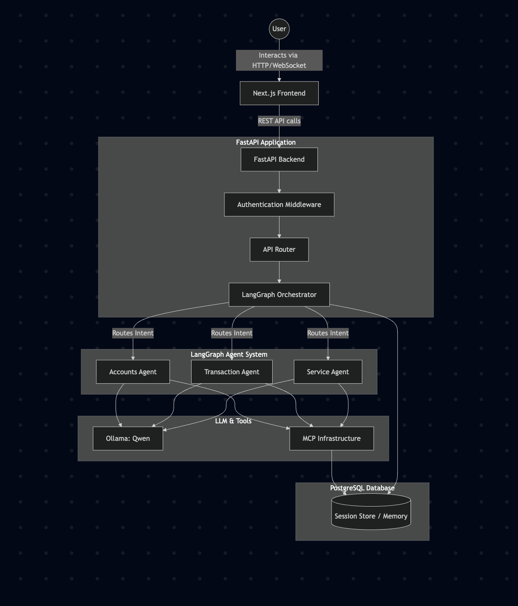

# Implementation Status & Architecture

## Current Progress

We are following a structured, phase-by-phase execution plan. As of right now, we have successfully completed **Phase 1**, **Phase 2**, and **Phase 3**.

### Completed Phases

- **Phase 1: Architecture & Technology Decisions**
  - Confirmed the core technology stack:
    - **Frontend**: Next.js (React)
    - **Backend API**: FastAPI (Python)
    - **Orchestrator & Agents**: LangGraph + LangChain
    - **LLM Provider**: Ollama (Qwen model)
    - **Database**: PostgreSQL (via Docker)
    - **Deployment**: Docker Compose for local infrastructure

- **Phase 2: Project Initialization**
  - Scaffolded the root repository with `.gitignore`, `README.md`, and `docker-compose.yml`.
  - Created the **Backend** environment:
    - Generated a Python virtual environment (`venv`).
    - Installed required dependencies (`fastapi`, `langgraph`, `langchain-ollama`, `asyncpg`, etc.).
    - Created the core folder structure (`app/api`, `app/agents`, `app/core`, `app/models`).
    - Scaffolded the FastAPI entrypoint (`main.py`).
  - Created the **Frontend** environment:
    - Initialized a new Next.js application using `create-next-app` with Tailwind CSS, TypeScript, and ESLint.
    - Set up a premium dark-mode aesthetic foundation in `globals.css`.

- **Phase 3: Backend & API Layer**
  - Implemented request/response Pydantic schemas.
  - Setup modular application configuration (`config.py`).
  - Added custom centralized exception handlers (`errors.py`) to catch validation & domain-specific errors.
  - Created initial `/api/chat` POST route returning structured mock responses.

---

## High-Level Architecture

The banking chatbot follows a decoupled, agent-oriented micro-architecture:

### Component Details

1. **Next.js Frontend**: Provides a highly responsive UI with dark mode support. Communicates with the FastAPI backend via standard REST APIs (and potentially WebSockets later for streaming LLM responses).
2. **FastAPI Backend**: Acts as the main gateway. Handles authentication, payload validation, session management, and forwards requests to the LangGraph system.
3. **LangGraph Orchestrator**: The "brain" of the chatbot. It determines what the user wants (Intent Detection) and routes the request to specialized sub-agents.
4. **Specialized Agents**: 
   - **Accounts**: Handles balance inquiries and account details.
   - **Transactions**: Handles statements, transfers, and transaction history.
   - **Services**: Handles cheque books, address changes, etc.
5. **Ollama (Qwen)**: The local LLM engine powering all LangChain agents.
6. **PostgreSQL**: Serves a dual purpose:
   - Stores mock banking data (accounts, transactions).
   - Stores LangGraph state/checkpointing to maintain memory across conversation turns.

---

## Pending Next Steps

We are now ready to begin **Phase 4: Authentication & Authorization**, which will involve:
1. Implementing the selected JWT/session authentication mechanism.
2. Setting up user authentication routers and login endpoints.
3. Securing API endpoints and establishing roles/permissions framework for agent interactions.

